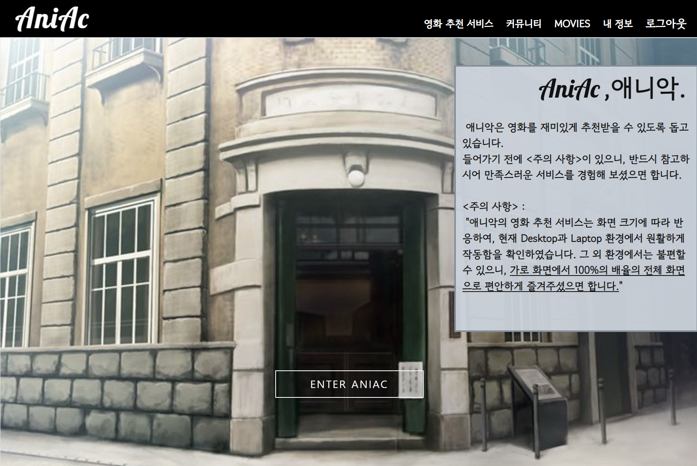
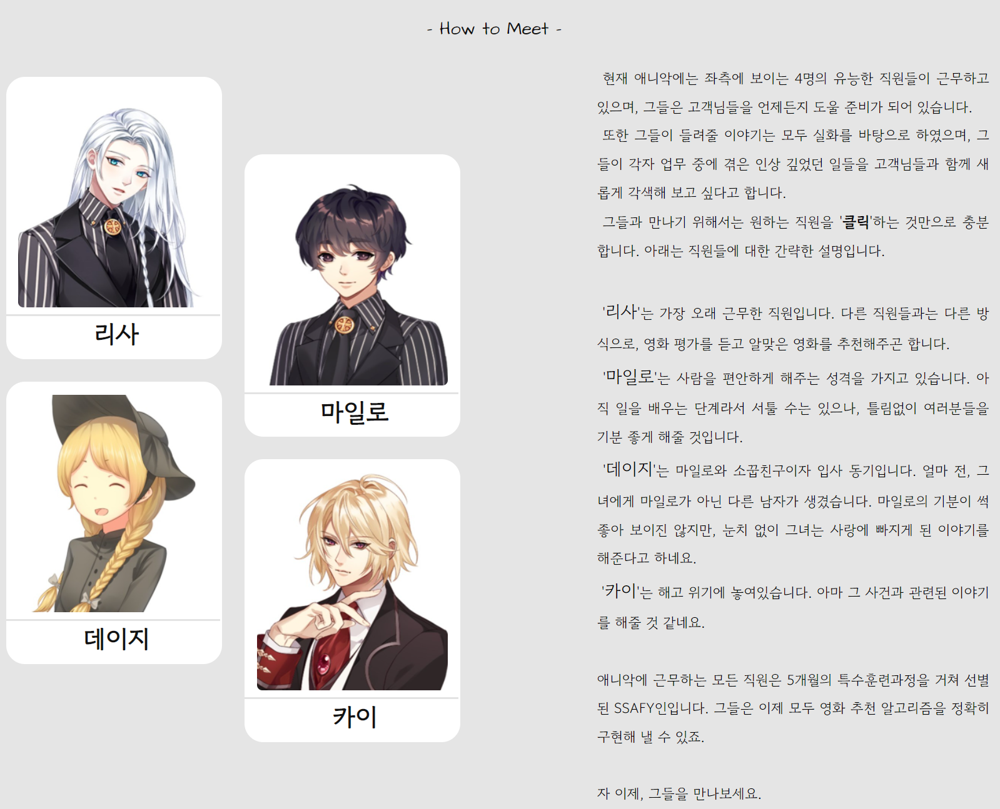

# ✨ Project AniAc 📋

---

Outline : '2022년 5월 20일 ~ 2022년 5월 27일'의 기간 동안, 삼성 청년 소프트웨어 아카데미에서 1학기를 마무리하며 '영화 데이터 기반 추천 서비스'라는 주제의 프로젝트를 진행하였고, 그 동안 나는 페어와 함께 본 프로젝트를 개발할 수 있었다. 이 프로젝트는 "애니악(AniAc, Animation + Academy)"라고 부르기로 하였다. 이는, Animation과 Academy의 합성어로, 한 학기 동안 삼성 청년 소프트웨어 아카데미에서 배운 내용을 토대로 최종 프로젝트를 수행할 때에, 해결 방법으로 애니메이션을 더했기 때문에 '애니악'이라고 이름 붙였다.

 많은 애정을 가지고 있는 첫 프로젝트 이기에 솔직하고 상세하게 README를 작성해보려 한다. 이 문서에는 프로젝트 실행 방법으로 시작하여,  내가 직접 프로젝트에 대해 진행한 내용과 더불어, 프로젝트를 수행하며 느낀 점에 대해서도 기술하려 한다.

<br>

---

✅ **- 프로젝트 애니악 실행 방법 -**

> 1. git bash 터미널에 다음과 같이 입력합니다.
>
>    ```bash
>     git clone https://github.com/dozinq/Project_AniAc.git
>    ```
>
> 2. 터미널을 켠 후, *(clone 받은 폴더 위치에서 IDE를 켜는 것을 권장하며, 위에서 이어서 해도 무방합니다.)*
>
>    ```bash
>     python -m venv venv
>    source venv/Scripts/activate
>    pip install -r requirements.txt
>    python manage.py makemigrations && python manage.py migrate
>    python manage.py loaddata movies.json
>    python manage.py collectstatic
>    (-> yes 입력)
>    python manage.py runserver
>    ```
>
> 3. 구동된 서버를 오픈하여 주소창에 다음과 같이 입력하면, 메인 화면을 만날 수 있습니다..
>
>    `127:0.0.1:8000/movies/main`
>
> 4. 회원가입과 로그인 후에 navbar에 '영화 추천 서비스'를 클릭하면 영화를 추천받으실 수 있습니다.

<br>

---

- *프로젝트 필수 요구사항 : ' 영화 추천 알고리즘을 사용하여 영화 데이터 기반 추천 서비스를 만들고 그 웹 페이지에는 커뮤니티 서비스와 회원 관리 기능이 필수적으로 요구된다. 사용자에게 제공되는 영화 추천 방식은 자유롭게 구성하며, 해당 서비스를 이용하는 사용자는 반드시 영화를 추천 받을 수 있어야 한다.'*


위와 같이 자율적으로 추천 기능을 구현할 수 있게 요구받았으며, 앞으로는 제가 이에 대해 직접적으로 관여한 부분에 대해서만 작성해 보겠습니다. 들어가기 전에, 저 도진욱과 페어는 역할을 분담하여 본 프로젝트를 진행하였으며, 다음은 구체적인 **업무 분담 내역**입니다.

| 도진욱 | Visual Novel을 이용한 영화 추천 서비스 기획 및 제작  / Signup, Login, Main 페이지 디자인 |
| ------ | ------------------------------------------------------------ |
| 페어   | Django CRUD 구현(Accounts, Movie, Community) / DB 제공       |

<br>

---

#### 💁‍♂️ 영화 추천 서비스에 "비주얼 노벨"을 활용한 이유

>  개인적인 이야기이지만, 2022년 5월 14일의 이야기를 적어보려 합니다. 저는 최종 프로젝트를 앞두고 기분 전환 겸, 주말에 강남 SETEC에서 개최한 희귀반려동물박람회에 방문하였습니다. 당시 근처 도로상황은 마비되어 있었고, 상상 이상으로 많은 사람들이 줄을 서고 있었습니다. 도착해서 알았지만 SETEC에서는 3개의 박람회를 동시 개최하고 있었고, 수많은 사람들은 만화 박람회(서울 코믹월드)에 들어가기 위해 줄을 서고 있었던 것입니다.
>
>  그 때, 만화에 대한 수요가 정말 많다는 것을 깨달았습니다. 그리고 최종프로젝트를 어떻게 진행해야 좋을 지 고민하던 저는 이를 적용해 보기로 결심하였습니다. 집에 돌아와 만화와 관련된 여러가지 핸드폰 게임을 다운받아 보았고, 그 중 '비주얼 노벨'이라는 게임 장르가 적용하기에 가장 적합하다고 판단되었습니다.
>
>  비주얼 노벨이란, 만화 속에 들어간 것처럼 이야기를 관람할 수 있으며, 상황마다 선택지를 고르며 최종적으로 만나게 될 결말에 직접적으로 관여할 수 있는 게임 장르입니다. 이를 위해 많은 만화 캐릭터들이 각 상황에 맞게 표정을 바꿔가며 표현하곤 하였습니다.
>
>  즉, 비주얼 노벨을 활용하여 영화 추천 서비스를 개발한다면 다음과 같을 것이라고 그려볼 수 있었습니다.
>
>  1. 각 선택지를 고르며 이야기의 흐름을 따라가며, 사용자는 영화 추천 과정에 지루해하지 않을 것이다.
>  2. 선택한 정보들을 기반으로, 최종적으로 조건에 맞는 영화 추천 목록이 출력되어야 한다.
>  3. 재미있는 스토리를 구성한다면, 컴퓨터가 아닌 캐릭터들이 직접 추천해 준다고 여겨질 것이고, 결과적으로, 사용자는 영화 추천 기능이 친근하게 느껴질 것이다.

<br>

---

### 🎨 애니악 컨셉

 영화를 추천 받기 위해 웹페이지에 방문한 사용자는 추천 받는 과정이 지루하지 않아야 한다는 것에 집중하여 컨셉을 그려보았습니다. 그렇기에 애니악 세계관을 직접 제시해 보았습니다.

 사용자는 영화를 추천 받기 위해 웹페이지를 방문하는 것만으로도, 어느 기관에 방문한 것 같은 느낌을 받을 수 있어야 한다고 생각하였습니다. 그렇기에 다음과 같이 건물 입구에 들어가는 듯한 느낌으로 디자인하였습니다.



 애니악에 들어가기 전, 주의 사항을 게시해 놓았습니다. 다음에 이어질 추천 서비스를 온전하게 즐길 수 있으려면, 사용자는 **전체 화면**으로 설정해 놓아야 하기 때문입니다.

 'ENTER ANIAC'을 누른다면, 해당 페이지 아래 부분에 작성해놓은 곳에 다다를 수 있게 하였습니다. (스크롤을 조금만 내려도 만날 수 있습니다.) 아래 부분은 다음과 같습니다.



 위와 같은 페이지를 구성하였습니다. 좌측의 네 명의 캐릭터는 애니악의 **직원**입니다. 그들은 직접 각자의 이야기를 보여주며 재미있게 영화 추천을 도와줄 것입니다. 초상화를 클릭하기만 하면 그들과 만나볼 수 있습니다. 또한, 페이지 우측에는 애니악의 **세계관**에 대해 적어 놓았습니다. 이로써 사용자들은 더 흥미롭게 빠져들게 될 것이라 생각했습니다.

<br>

---

### 🎞 애니악을 통한 영화 추천 과정

 지금부터는 실제 직원들과의 만남을 통해 어떻게 영화 추천을 받는 지에 대해 간략하게 적어보도록 하겠습니다.

 


-미완-

작성 할 내용: 실행 화면 예시와 그에 대한 설명, 사용한 영화 추천 알고리즘, 사용한 툴과 참고한 곳 폰트 두 개, 왜 해당 repository를 만들어 게시하게 되었는지, 느낀 점(모노가타리 툴 사용 못한 점, 스토리를 구성하며 느꼈던 점)
