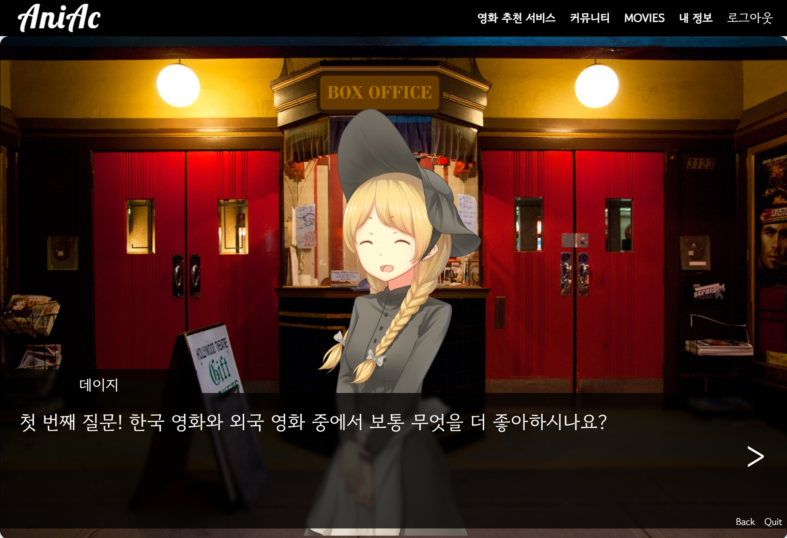
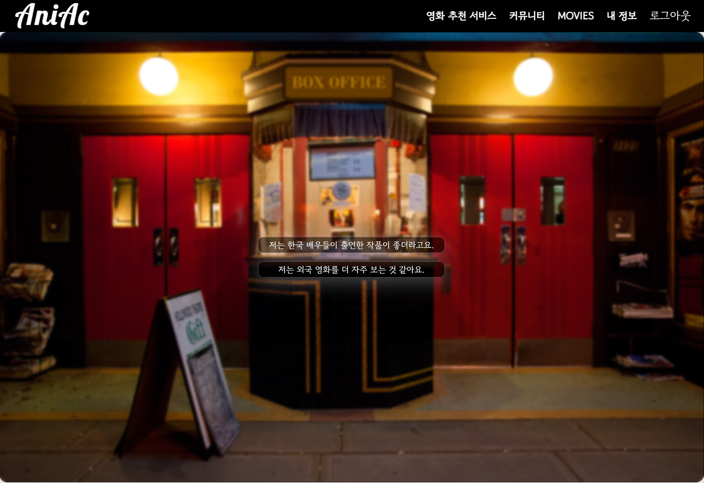

# ✨ Project AniAc 📋

---

Outline : '2022년 5월 20일 ~ 2022년 5월 27일'의 기간 동안, 삼성 청년 소프트웨어 아카데미에서 1학기를 마무리하며 '영화 데이터 기반 추천 서비스'라는 주제의 프로젝트를 진행하였고, 그 동안 나는 페어와 함께 본 프로젝트를 개발할 수 있었다. 이 프로젝트는 "애니악(AniAc, Animation + Academy)"라고 부르기로 하였다. 이는, Animation과 Academy의 합성어로, 한 학기 동안 삼성 청년 소프트웨어 아카데미에서 배운 내용을 토대로 최종 프로젝트를 수행할 때에, 해결 방법으로 애니메이션을 더했기 때문에 '애니악'이라고 이름 붙였다.

 많은 애정을 가지고 있는 첫 프로젝트 이기에 솔직하고 상세하게 README를 작성해보려 한다. 이 문서에는 프로젝트 실행 방법으로 시작하여,  내가 직접 프로젝트에 대해 진행한 내용과 더불어, 프로젝트를 수행하며 느낀 점에 대해서도 기술하려 한다.

<br>

---

### ⏩ 목차

> 1. [프로젝트 애니악 실행 방법](#chapter_1)
> 2. [프로젝트 필수 요구사항 및 이에 대한 업무 분담 내역](#chapter_2)
> 3. [영화 추천 서비스에 "비주얼 노벨"을 활용한 이유](#chapter_3)
> 4. [애니악 컨셉](#chapter_4)
> 5. [애니악을 통한 영화 추천 과정](#chapter_5)
>    1. [리사](#chapter_5_1)
>    2. [마일로](#chapter_5_2)
>    3. [데이지](#chapter_5_3)
>    4. [카이](#chapter_5_4)
> 6. [애니악에서 사용하는 영화 추천 알고리즘](#chapter_6)
> 7. [애니악 구현을 위해 사용한 툴과 도움을 받은 곳](#chapter_7)
> 8. [프로젝트를 수행하며 느낀 점](#chapter_8)

<br>

---

### ✅ **- 프로젝트 애니악 실행 방법 -** <a id="chapter_1"></a>

> 1. git bash 터미널에 다음과 같이 입력합니다.
>
>    ```bash
>     git clone https://github.com/dozinq/Project_AniAc.git
>    ```
>
> 2. 터미널을 켠 후, *(clone 받은 폴더 위치에서 IDE를 켜는 것을 권장하며, 위에서 이어서 해도 무방합니다.)*
>
>    ```bash
>     python -m venv venv
>    source venv/Scripts/activate
>    pip install -r requirements.txt
>    python manage.py makemigrations && python manage.py migrate
>    python manage.py loaddata movies.json
>    python manage.py collectstatic
>    (-> yes 입력)
>    python manage.py runserver
>    ```
>
> 3. 구동된 서버를 오픈하여 주소창에 다음과 같이 입력하면, 메인 화면을 만날 수 있습니다.
>
>    `127:0.0.1:8000/movies/main`
>
> 4. 회원가입과 로그인 후에 navbar에 '영화 추천 서비스'를 클릭하면 영화를 추천받으실 수 있습니다.

<br>

---

### 👨🏻‍🤝‍👨🏻 프로젝트 필수 요구사항 및 이에 대한 업무 분담 내역 <a id="chapter_2"></a>

- *프로젝트 필수 요구사항 : ' 영화 추천 알고리즘을 사용하여 영화 데이터 기반 추천 서비스를 만들고 그 웹 페이지에는 커뮤니티 서비스와 회원 관리 기능이 필수적으로 요구된다. 사용자에게 제공되는 영화 추천 방식은 자유롭게 구성하며, 해당 서비스를 이용하는 사용자는 반드시 영화를 추천 받을 수 있어야 한다.'*


위와 같이 자율적으로 추천 기능을 구현할 수 있게 요구받았으며, 앞으로는 제가 이에 대해 직접적으로 관여한 부분에 대해서만 작성해 보겠습니다. 들어가기 전에, 저 도진욱과 페어는 역할을 분담하여 본 프로젝트를 진행하였으며, 다음은 구체적인 **업무 분담 내역**입니다.

| 도진욱 | Visual Novel을 활용한 영화 추천 서비스 기획 및 제작  / Signup, Login, Main 페이지 디자인 / 발표 |
| ------ | ------------------------------------------------------------ |
| 팀원   | Django CRUD 구현(Accounts, Movie, Community) / DB 제공       |

<br>

---

### 💁‍♂️ 영화 추천 서비스에 "비주얼 노벨"을 활용한 이유 <a id="chapter_3"></a>

>  개인적인 이야기이지만, 2022년 5월 14일의 이야기를 적어보려 합니다. 저는 최종 프로젝트를 앞두고 기분 전환 겸, 주말에 강남 SETEC에서 개최한 희귀반려동물박람회에 방문하였습니다. 당시 근처 도로상황은 마비되어 있었고, 상상 이상으로 많은 사람들이 줄을 서고 있었습니다. 도착해서 알았지만 SETEC에서는 3개의 박람회를 동시 개최하고 있었고, 수많은 사람들은 만화 박람회(서울 코믹월드)에 들어가기 위해 줄을 서고 있었던 것입니다.
>
>  그 때, 만화에 대한 수요가 정말 많다는 것을 깨달았습니다. 그리고 최종프로젝트를 어떻게 진행해야 좋을 지 고민하던 저는 이를 적용해 보기로 결심하였습니다. 집에 돌아와 만화와 관련된 여러가지 핸드폰 게임을 다운받아 보았고, 그 중 '비주얼 노벨'이라는 게임 장르가 적용하기에 가장 적합하다고 판단되었습니다.
>
>  비주얼 노벨이란, 만화 속에 들어간 것처럼 이야기를 관람할 수 있으며, 상황마다 선택지를 고르며 최종적으로 만나게 될 결말에 직접적으로 관여할 수 있는 게임 장르입니다. 이를 위해 많은 만화 캐릭터들이 각 상황에 맞게 표정을 바꿔가며 표현하곤 하였습니다.
>
>  즉, 비주얼 노벨을 활용하여 영화 추천 서비스를 개발한다면 다음과 같을 것이라고 그려볼 수 있었습니다.
>
>  1. 각 선택지를 고르며 이야기의 흐름을 따라가며, 사용자는 영화 추천 과정에 지루해하지 않을 것이다.
>  2. 선택한 정보들을 기반으로, 최종적으로 조건에 맞는 영화 추천 목록이 출력되어야 한다.
>  3. 재미있는 스토리를 구성한다면, 컴퓨터가 아닌 캐릭터들이 직접 추천해 준다고 여겨질 것이고, 결과적으로, 사용자는 영화 추천 기능이 친근하게 느껴질 것이다.

<br>

---

### 🎨 애니악 컨셉 <a id="chapter_4"></a>

 영화를 추천 받기 위해 웹페이지에 방문한 사용자는 추천 받는 과정이 지루하지 않아야 한다는 것에 집중하여 컨셉을 그려보았습니다. 그렇기에 애니악 세계관을 직접 제시해 보았습니다.

 사용자는 영화를 추천 받기 위해 웹페이지를 방문하는 것만으로도, 어느 기관에 방문한 것 같은 느낌을 받을 수 있어야 한다고 생각하였습니다. 그렇기에 다음과 같이 건물 입구에 들어가는 듯한 느낌으로 디자인하였습니다.


 애니악에 들어가기 전, 주의 사항을 게시해 놓았습니다. 다음에 이어질 추천 서비스를 온전하게 즐길 수 있으려면, 사용자는 **전체 화면**으로 설정해 놓아야 하기 때문입니다.

 'ENTER ANIAC'을 누른다면, 해당 페이지 아래 부분에 작성해놓은 곳에 다다를 수 있게 하였습니다. (스크롤을 조금만 내려도 만날 수 있습니다.) 아래 부분은 다음과 같습니다.


 위와 같은 페이지를 구성하였습니다. 좌측의 네 명의 캐릭터는 애니악의 **직원**입니다. 그들은 직접 각자의 이야기를 보여주며 재미있게 영화 추천을 도와줄 것입니다. 초상화를 클릭하기만 하면 그들과 만나볼 수 있습니다. 또한, 페이지 우측에는 애니악의 **세계관**에 대해 적어 놓았습니다. 이로써 사용자들은 더 흥미롭게 빠져들게 될 것이라 생각했습니다.

<br>

---

### 🎞 애니악을 통한 영화 추천 과정 <a id="chapter_5"></a>

 지금부터는 실제 직원들과의 만남을 통해 어떻게 영화 추천을 받는 지에 대해, 실제 실행 과정에서의 사진을 첨부하여 간략하게 작성해 보겠습니다.

1. <a id="chapter_5_1"></a>직원 '**리사**'를 클릭한다면, 리사는 유명 영화들에 대한 사용자의 평가를 듣고, 결과로는 그와 유사한 영화 목록 중 인기순으로 5가지의 영화들을 추천해 줄 것입니다.

   

   *(위는 실제 실행 중에 캡쳐한 사진이며, 스포일러 방지를 위해 자세한 스토리에 대한 설명은 생략하겠습니다.)*

   사용자는 간단한 스토리를 즐길 수 있으며, 결과적으로 영화를 추천하는 곳인 '애니악'에 방문하게 되고, 사용자는 그곳에서 '리사'를 만나게 됩니다.

   

   위와 같이 추천해주게 됩니다. 수락 시, 다음과 같은 화면을 만나며 사용자는 영화를 추천받게 됩니다.

   

   사용자에게 영화에 대한 질문을 하게 되며, 이에 대해 사용자는  **1. 그렇다 / 2. 그렇지 않다 / 3. 보지 않았다.** 라는 대답을 선택할 수 있습니다. '그렇다'를 클릭하게 될 시, 그 영화는 유사 영화 추출 리스트에 추가되게 됩니다. 제시되는 영화는 제가 임의로 국내 영화를 관람객 수 순으로 정렬 후에 9가지만 골라보았습니다.

   

   결과 화면은 다음과 같이 나타나게 됩니다. 저 사진에서의 결과물에 대해 간략하게 설명하자면 다음과 같습니다.

   > 익명의 사용자는 다음과 같이 대답하였습니다.
   >
   > 첫 번째로 제시되는 영화 <명량>에 대해 재미있게 보았다고 답하였으며,
   >
   > 두 번째로 제시되는 영화 <극한직업>에 대해 재미없었다고 답하였으며,
   >
   > 세 번째로 제시되는 영화 <신과 함께>에 대해 관람하지 않았다고 답하였으며,
   >
   > 네 번째로 제시되는 영화 <국제시장>에 대해 재미없었다고 답하였으며,
   >
   > 다섯 번째로 제시되는 영화 <어벤져스>에 대해 재미없었다고 답하였으며,
   >
   > 여섯 번째로 제시되는 영화 <겨울왕국>에 대해 재미없었다고 답하였으며,
   >
   > 일곱 번째로 제시되는 영화 <베테랑>에 대해 재미있게 보았다고 답하였으며,
   >
   > 여덟 번째로 제시되는 영화 <도둑들>에 대해 재미있게 보았다고 답하였으며,
   >
   > 아홉 번째로 제시되는 영화 <7번방의 선물>에 대해 재미있게 보았다고 답하였습니다.
   >
   > 그 결과로 재미있게 보았다고 답한, '영화 <명량>, 영화 <베테랑>, 영화 <도둑들>, 영화<7번방의 선물>' 과 유사한 영화에 대해 TMDB 사이트에 API 통신을 요청하였고, 결과로 얻은 목록들을 인기순으로 정렬 후에 상위 5가지의 영화에 대해서 출력하여 보여주게 하였습니다.

   이후, 다시 리사에게 영화를 추천받고 싶다면 사용자는 '리사와 다시 대화하기' 버튼을 클릭하면 되고, '메인 화면으로 돌아가기' 버튼을 클릭한다면, '애니악'의 메인 페이지로 이동하게 됩니다.

<br>

2. <a id="chapter_5_2"></a>직원 '**마일로**'를 클릭한다면, 마일로는 사용자의 영화 성향에 대해 파악하고 그에 맞는 영화들을 추천해 줄 것입니다.

   

   *(위는 실제 실행 중에 캡쳐한 사진이며, 스포일러 방지를 위해 자세한 스토리에 대한 설명은 생략하겠습니다.)*

   사용자는 간단한 스토리를 즐길 수 있으며, 결과적으로 영화를 추천하는 곳인 '애니악'에 방문하게 되고, 사용자는 그곳에서 '마일로'를 만나게 됩니다.

   

   위와 같이 추천해주게 됩니다. 이후 다음과 같은 질문들을 만나며 사용자의 영화 성향을 파악합니다.

   

   다음은 선택지 중 일부를 캡쳐한 사진입니다. 위와 같이 사용자의 영화 성향에 대해 파악합니다. 사용자는 총 5가지의 영화 성향 질문에 대해 답할 수 있습니다. 모든 질문에 대한 답변이 끝나면 결과 창을 마주할 수 있습니다.

   

   위와 같이 결과창을 마주할 수 있게 되며, 결과창이 위와 같이 출력되기까지 사용자는 어떻게 질문에 대답하였는지 작성해 보겠습니다.

   > 익명의 사용자는 다음과 같이 대답하였습니다.
   >
   > 첫 번째 질문인 '영화 제작 국가 선호 여부'에 대해 신경쓰지 않고 골고루 좋아한다고 답하였으며,
   >
   > 두 번째 질문인 '애니메이션 영화 선호 여부'에 대해 애니메이션이 첨가된 영화를 좋아한다고 답하였으며,
   >
   > 세 번째 질문인 '선호 영화 장르'에 대해 감동적인 영화를 좋아한다고 답하였으며,
   >
   > 네 번째 질문인 '최신 영화 선호 여부'에 대해 최근에 나온 영화를 좋아하는 편이라고 답하였으며,
   >
   > 다섯 번째 질문인 '영화 평점에 대해 신경쓰는 지 여부'에 대해 그렇지 않다고 답하였습니다.
   >
   > 그 결과를 토대로 TMDB 사이트에 API 통신을 요청하였고, 결과로 얻은 목록들을 인기순으로 정렬 후에상위 5가지의 영화에 대해서 출력하여 보여주게 하였습니다.

   이후, 다시 마일로에게 영화를 추천받고 싶다면 사용자는 '마일로와 다시 대화하기' 버튼을 클릭하면 되고, '메인 화면으로 돌아가기' 버튼을 클릭한다면, '애니악'의 메인 페이지로 이동하게 됩니다.

<br>

3. <a id="chapter_5_3"></a>직원 '**데이지**'를 클릭한다면, 데이지는 사용자의 영화 성향에 대해 파악하고 그에 맞는 영화들을 추천해 줄 것입니다.

   

   *(위는 실제 실행 중에 캡쳐한 사진이며, 스포일러 방지를 위해 자세한 스토리에 대한 설명은 생략하겠습니다.)*

   사용자는 간단한 스토리를 즐길 수 있으며, 결과적으로 영화를 추천하는 곳인 '애니악'에 방문하게 되고, 사용자는 그곳에서 '데이지'를 만나게 됩니다.

   

   데이지는 인사를 하고 나서, 이후 5가지의 질문들을 통해 사용자의 영화 성향을 파악합니다.

   

   다음은 선택지 중 일부를 캡쳐한 사진입니다. 위와 같이 사용자의 영화 성향에 대해 파악합니다. 사용자는 총 5가지의 영화 성향 질문에 대해 답할 수 있습니다. 모든 질문에 대한 답변이 끝나면 결과 창을 마주할 수 있습니다.

   

   위와 같은 결과창을 마주할 수 있게 되며, 결과창이 위와 같이 출력되기까지 사용자는 어떻게 질문에 대답하였는지 작성해 보겠습니다.

   > 익명의 사용자는 다음과 같이 대답하였습니다.
   >
   > 첫 번째 질문인 '영화 제작 국가 선호 여부'에 대해 일본에서 제작한 영화를 좋아한다고 답하였으며,
   >
   > 두 번째 질문인 '애니메이션 영화 선호 여부'에 대해 애니메이션이 첨가된 영화를 좋아한다고 답하였으며,
   >
   > 세 번째 질문인 '선호 영화 장르'에 대해 로맨스 장르의 영화를 좋아한다고 답하였으며,
   >
   > 네 번째 질문인 '최신 영화 선호 여부'에 대해 최근에 나온 영화를 좋아하는 편이라고 답하였으며,
   >
   > 다섯 번째 질문인 '영화 평점에 대해 신경쓰는 지 여부'에 대해 그렇다고 답하였습니다.
   >
   > 그 결과를 토대로 TMDB 사이트에 API 통신을 요청하였고, 결과로 얻은 목록들을 인기순으로 정렬 후에상위 5가지의 영화에 대해서 출력하여 보여주게 하였습니다.

   이후, 다시 데이지에게 영화를 추천받고 싶다면 사용자는 '데이지와 다시 대화하기' 버튼을 클릭하면 되고, '메인 화면으로 돌아가기' 버튼을 클릭한다면, '애니악'의 메인 페이지로 이동하게 됩니다.

<br>

4. <a id="chapter_5_4"></a>직원 '**카이**'를 클릭한다면, 카이는 사용자의 영화 성향에 대해 파악하고 그에 맞는 영화들을 추천해 줄 것입니다.

   

   *(위는 실제 실행 중에 캡쳐한 사진이며, 스포일러 방지를 위해 자세한 스토리에 대한 설명은 생략하겠습니다.)*

   사용자는 간단한 스토리를 즐길 수 있으며, 결과적으로 영화를 추천하는 곳인 '애니악'에 방문하게 되고, 사용자는 그곳에서 '카이'를 만나게 됩니다.

   

   카이는 대화 후에, 사용자에게 질문들을 제시하며 영화를 추천해 줄 것입니다.

   

   다음과 같이 질문을 진행하며, 그 중 하나를 캡쳐한 사진입니다. 위와 같이 사용자의 영화 성향에 대해 파악합니다. 사용자는 총 5가지의 영화 성향 질문에 대해 답할 수 있습니다. 모든 질문에 대한 답변이 끝나면 결과 창을 마주할 수 있습니다.

   

   위와 같은 결과창을 마주할 수 있게 되며, 결과창이 위와 같이 출력되기까지 사용자는 어떻게 질문에 대답하였는지 작성해 보겠습니다.

   > 익명의 사용자는 다음과 같이 대답하였습니다.
   >
   > 첫 번째 질문인 '영화 제작 국가 선호 여부'에 대해 한국에서 제작한 영화를 좋아한다고 답하였으며,
   >
   > 두 번째 질문인 '애니메이션 영화 선호 여부'에 대해 그렇지 않다고 답하였으며,
   >
   > 세 번째 질문인 '선호 영화 장르'에 대해 공포, 스릴러 장르의 영화를 좋아한다고 답하였으며,
   >
   > 네 번째 질문인 '최신 영화 선호 여부'에 대해 오래된 영화들도 좋아하는 편이라고 답하였으며,
   >
   > 다섯 번째 질문인 '영화 평점에 대해 신경쓰는 지 여부'에 대해 그렇지 않다고 답하였습니다.
   >
   > 그 결과를 토대로 TMDB 사이트에 API 통신을 요청하였고, 결과로 얻은 목록들을 인기순으로 정렬 후에상위 5가지의 영화에 대해서 출력하여 보여주게 하였습니다.

   이후, 다시 카이에게 영화를 추천받고 싶다면 사용자는 '카이와 다시 대화하기' 버튼을 클릭하면 되고, '메인 화면으로 돌아가기' 버튼을 클릭한다면, '애니악'의 메인 페이지로 이동하게 됩니다.

<br>

---

### 💡 애니악에서 사용하는 영화 추천 알고리즘 <a id="chapter_6"></a>

 애니악에서 사용하는 영화 추천 알고리즘은 두 가지입니다. 첫 번째는 고객님들이 관람했던 영화들의 평가를 기반으로 영화를 추천해주는 알고리즘이고, 두 번째로는 고객님들의 영화 취향을 파악하여 영화를 추천해주는 알고리즘입니다. 그것에 대해 서술해 보도록 하겠습니다.

1. #### 사용자들이 관람한 영화들에 대한 평가를 기반으로 영화를 추천해주는 알고리즘

   >  이를 구현하기 위해, 사용자들에게 직접 물어볼 수 있게 하였습니다. 아마도 직원들을 직접 마주하고 직원과 대화할 수 있는 환경이어서 자연스러울 것이라고 생각이 되었고, 이를 현실로 옮기는 것은 어렵지 않았습니다. 간단한 알고리즘이기 때문입니다. TMDB 사이트에서 get_similar_movies 를 요청하면 되었는데, 필수 요청 사항으로는 영화들의 고유번호가 필요하였습니다. 즉, 영화들의 고유번호를 제시해 준다면 그들과 유사한 영화 목록을 JSON파일 형식으로 받아볼 수 있게 되는 것입니다.
   >
   >  이는 애니악 세계관에서 가장 오래 근무한 '리사'라는 직원이 고객님들에게 보다 더 유연하게 대처할 수 있을 것이라고 판단되어 컨셉을 정하고 적용시킬 수 있었습니다. 즉, 리사는 애니악에 오래 근무하였으므로, 다른 직원들이 영화를 추천해주는 방식과는 다르게 인기 영화들의 제목을 나열하고 그에 대한 평가를 진행할 수 있게끔 해주는 것입니다.
   >
   >  더 상세하게 적어보자면 다음과 같습니다. 국내 영화 중 관람객 수 순으로 정렬을 해보았고, 그렇게 유명한 영화 9가지를 임의로 선정하였습니다. `<명량>, <극한직업>, <신과 함께>, <국제시장>, <어벤져스>, <겨울왕국>, <베테랑>, <도둑들>, <7번방의 선물>` 에 대한 평가를 사용자에게 요청합니다. 각 영화들을 재미있게 보았다고 답을 받는다면, 그 답변은 기록될 수 있게 하였습니다. 9가지의 영화에 대해 답변이 끝난다면, 그 영화들과 유사한 영화 목록을 받아올 수 있게 하였습니다.
   >
   >  기본 URL은  `'https://api.themoviedb.org/3/movie/'` 과 같습니다. 그리고 각 영화에 대해 좋게 평가한다면, 각 영화의 고유 번호인 ID를 URL 뒤에 이어서 추가하게 됩니다. 모든 영화에 대한 답변을 마쳤다면, `'/similar?api_key=d398c62ee408c5afcf987f7c3eb460b4&language=ko-KR&page=1'` 를 뒤에 붙이게 됩니다. *(오류를 방지하기 위해, 모든 영화에 대한 평가가 좋지 못하거나 보지 않았다면, 기본적인 영화를 추천받을 수 있게 하였습니다.)*
   >
   >  그렇게 최종 URL을 만들어서 요청한다면, TMDB로부터 유사 영화 목록을 받을 수 있게 되고, 이를 인기순으로 정렬시켜 상위 5개의 영화의 정보에 대해 사용합니다. 위의 결과창에서 확인할 수 있듯이 영화의 포스터와 제목만을 최종적으로 출력시킬 수 있게 하였습니다.

2. #### 사용자들의 영화 취향을 파악하여 영화를 추천해주는 알고리즘

   >  리사를 제외한 3명의 직원은 이와 같은 영화 추천 알고리즘을 사용합니다. 그들은 애니악 세계관에서 리사만큼 오래 근무하지 않아서 매뉴얼대로 영화 추천 서비스를 진행하는 컨셉입니다. 물론 각 캐릭터들마다 말투와 표정이 달라서 지루하지 않게 구현하였습니다.
   >
   >  TMDB 사이트에서 discover_movies를 요청하게 되며, 그를 위해 각 정보가 필요하였기에 각 정보는 사용자들의 취향에 맞춰서 요청할 수 있게 하였습니다. 질문들의 내용과 그에 대한 대답은 다음과 같습니다. *(화살표 이후에 작성한 것은 구현 당시 적용하였던 내용 혹은 내부적으로 작동되는 기능에 대한 부가적인 설명입니다.)*
   >
   > ```markdown
   > 1-1. 영화 제작 국가 선호도 조사 (➡ TMDB 사이트 내에서는 영화 제작 국가에 대한 직접적인 제시는 존재하지 않으며, 영화 제작 당시의 언어를 제시할 수 있도록 하였으므로 이를 활용하였습니다.)
   > 	1. 한국
   > 	2. 외국
   > 	1-2. 외국 선택 시, 정확한 제작 국가 재 질문
   > 		1. 미국
   > 		2. 일본
   > 		3. 그 외 (➡ 이를 선택할 시, 제작 국가에 대해 필터링하지 않습니다.)
   > 2. 애니메이션 영화에 대한 선호도 조사
   > 	1. 선호한다.
   > 	2. 선호하지 않는다. (➡ 이를 선택할 시, 애니메이션 장르에 대해 필터링하지 않습니다.)
   > 3. 영화 장르 선호도 조사
   > 	1. 로맨스
   > 	2. 판타지, 모험
   > 	3. 공포, 스릴러
   > 	4. 코미디
   > 	5. 감동 (➡ 가족, 드라마 장르의 영화에 대해 필터링합니다.)
   > 4. 최신 영화에 대한 필터링 여부
   > 	1. 그렇다. (➡ 최근 5년 내에 개봉한 영화들에 대해 필터링합니다.)
   > 	2. 아니다.
   > 5. 영화 평점에 대한 신뢰도 여부
   > 	1. 그렇다. (➡ 평점이 8점 이상인 영화들에 대해 필터링합니다.)
   > 	2. 아니다.
   > ```
   >
   > 위와 같은 알고리즘을 진행하며, 모든 대답에 대해 알맞게 URL을 설정하여 TMDB에 결과를 요청하게 합니다. `'https://api.themoviedb.org/3/discover/movie?api_key=d398c62ee408c5afcf987f7c3eb460b4&sort_by=popularity.desc&page=1&language=ko-KR'` 와 같이 discover_movies를 요청하되 인기순으로 정렬하여 한 페이지(최대20개)의 영화 목록들을 가져오게 할 것 입니다. 이에 뒤이어 위의 질문에 대해 알맞은 추가 URL을 덧붙일 수 있게 설정해 놓았습니다.
   >
   >  그렇게 최종 URL을 만들어서 요청한다면, TMDB로부터 사용자들의 취향에 맞는 영화 목록을 받을 수 있게 되고, 그 중 상위 5개의 영화의 정보에 대해 사용합니다. 위의 결과창에서 확인할 수 있듯이 영화의 포스터와 제목만을 최종적으로 출력시킬 수 있게 하였습니다.*(영화 추천 목록이 5개 미만으로 필터링받게 된다면 중복하여 영화를 표시할 수 있게끔 하여 오류를 최소화하고자 하였으며, 만약 필터링 결과가 없다면 오류를 반환시켜 다시 영화 추천을 진행할 수 있도록 하였습니다.)*

<br>

---

### 🔎 애니악 구현을 위해 사용한 툴과 도움을 받은 곳 <a id="chapter_7"></a>

 들어가기에 앞서, 애니악은 영화 추천 프로젝트 내에서 동작할 수 있게 구현하였습니다. 그렇기에 프로젝트 전반적으로 소개하자면, 해당 폴더에 게시된 `requirements.txt`에서 확인할 수 있듯이 해당 프로젝트는 *Django 3.2.9 version* 환경에서 제작되었으며, 프로젝트의 전반적인 디자인을 위해 css를 사용하였습니다. 이제 구현을 위해 사용한 툴과 도움을 받은 사이트에 대해 작성해 보겠습니다.

> 1.  프로젝트의 전반적인 디자인을 위해 도움받은 툴은 `Nicepage` 입니다. 저는 개발 공부를 하기 전, 개인적으로 ppt를 이용하여 많은 발표물들을 제작하였는데, 이와 비슷하게 제가 원하는 대로 디자인할 수 있어서 좋았던 것 같습니다. 또한 웹페이지의 기본적인 형식들을 바로 적용시킬 수 있게 템플릿의 예시들도 있어서 굉장히 빠르게 활용할 수 있었던 것 같습니다. 공식 사이트의 링크는 https://nicepage.com/ 입니다.
>
> 2.  애니악의 비주얼 노벨 적용에 대해 도움을 받을 수 있었던 게시글이 있습니다. 참고한 사이트의 링크는 https://garbage-collector.postype.com/ 이며, 해당 사이트의 '웹에서 비주얼 노벨 구현하기' 포스트에 많은 도움을 받았습니다.
> 3.  애니악 구현을 위해 배경화면과 캐릭터 그림은 `CLOUD NOVEL` 사이트에서 도움을 받았습니다. 해당 사이트는 비주얼 노벨을 직접 제작하거나, 다른 유저들이 제작한 비주얼 노벨을 실행할 수 있는 사이트이며, 각종 비주얼 노벨에 활용되는 배경과 캐릭터 그림을 게시해 놓았는데, 그 중 영화관에 가장 어울리는 캐릭터들을 골랐었고, 배경은 각 상황에 맞게 고를 수 있었습니다. 공식 사이트의 링크는 https://cloudnovel.net/ 입니다.
> 4. 프로젝트 전반적으로 사용한 폰트에 대해서도 적어보자면, 대체적으로 한글 폰트는 `Google Fonts`에서 다운받은 '고운 돋움(Gowun Dodum)'폰트를 사용하였으며, 영문 폰트는 `Google Fonts`에서 다운받은 'Lobster' 폰트를 사용하였습니다. 공식 사이트의 링크는 https://fonts.google.com/ 입니다.

<br>

---

 ### ✍ 프로젝트를 수행하며 느낀 점 <a id="chapter_8"></a>

느낀 점이 정말 많아서 어떤 말을 적어야 할까 굉장히 많은 고민을 하였습니다. 모든 생각에 대해 작성할 수는 없겠지만, 이를 읽고 있을 누군가를 위해 도움이 될 말을 전하려 합니다.

1.  애니악에 굉장히 많은 애정을 가지게 된 것에는 많은 이유가 있습니다. 가장 큰 이유라고 한다면, 제가 지금까지 만든 것 중 가장 집중해서 만든 첫 작품이기 때문입니다. 만드는 과정이 쉽진 않았어도 재미있었고, 스스로 스토리를 구성하는 과정에서도 많이 웃곤 했었습니다. 제가 담당했던 애니악의 전반적인 디자인과 프로젝트의 Signup, Login, Main 페이지를 디자인하면서도 완벽하고 싶어했습니다. 말그대로 디자인에 어떤 이유도 아닌, '제가 원하는 대로'를 실현할 수 있었기에 가능했던 것일 수도 있다고 생각합니다. 책임감을 느끼기 보다는 스스로 정한 목표를 성취하려 하였기에 더욱 열심히 할 수 있었습니다. 그 결과 애니악을 자랑스러워 할 수 있게 되었습니다.
2.  README 파일을 최대한 상세하게 적으려 하였습니다. 이 결과물을 같은 반 동기 분들께서 인정해주셨기 때문입니다. 교육받는 도중에도 모든 구성원이 학습능력이 너무 뛰어났다고 느꼈었고 지금도 다들 훌륭하다고 밖에 생각이 안드는데, 프로젝트 발표 후에 모두 너무 칭찬해주셔서 기쁜 마음에 상세히 적기 시작하였습니다. 저는 그동안 모두에게 많이 느끼고 배웠으니, 저도 누군가에게 도움이 되고 싶었습니다.
3.  프로젝트의 방향을 결정하기 전에 정말 많은 방법을 생각하였습니다. 만화를 적용할 것이라고 생각하기 전에, 유행하는 mbti 검사처럼 추천 과정을 진행하는 방법을 가장 유력하게 생각하고는 있었지만, 검사 과정이 지루하였던 기억이 있었기 때문입니다. 또한 만화에 대한 니즈를 파악하고 나서 비주얼 노벨을 적용하겠다고 페어를 설득할 때에도 사실 확신이 들지 않았습니다. 그 때는 적용 테스트 중에 자꾸 오류를 만났기 때문입니다. 그 오류는 다음과 이어집니다.
4.  사실, 애니악을 구상하며 테스트할 단계에서 많은 좌절을 하였습니다. 그 중에서도 가장 인상깊었던 점은, 사용하고 싶었던 비주얼 노벨 툴을 적용하지 못했다는 것입니다. 사실, '모노가타리'(monogatari, https://monogatari.io/) 툴을 프로젝트 내에 사용하기 위해 고군분투하였습니다. 굉장한 퀄리티를 프로젝트에 적용할 수 있게 된다면 좋을 것 같았기 때문입니다. 3일 동안 많은 시도를 해보았고, 시도 과정에서 Discord 채널에 들어가 툴 개발자분과 대화를 하였지만 결국 오류를 해결하지 못하였습니다. 깔끔히 포기하려 하였지만, 미련이 남아 한동안 계속 매달렸던 것 같습니다. 그 오류는 Django 환경에서는 url이 들어온다면 views.py를 거쳐 template을 참조한다는 것에 관련이 있는 것으로 추정됩니다.
5.  스토리를 구성하면서는 굉장히 많이 웃었지만서도 고통스러운 부분이 있습니다. 총 4개의 서로 다른 스토리를 구성하면서, 결국 사용자에게 영화를 추천받게끔 해야만 하였는데, 프로젝트 제작 시간이 매우 짧았기 때문에 만화를 즐겨 보지 않았던 저에게는 창작의 고통이 있었던 것 같습니다.
6. 사실 저는 css를 배울 당시, 선택자 우선순위에 대해서 깊게 생각하지 않았었습니다. 이번 프로젝트를 진행하며 Nicepage 툴을 적용하면서 깨달았습니다. !important는 사람을 힘들게 할 수도 있다고.
7.  느낀 점에 대해 가장 중요한 것을 적자면, 다음과 같습니다. 저는 스스로 굉장히 꼼꼼한 사람이라고 생각하며 살아왔던 것 같습니다. 실수에 대해서 많이 민감했기 때문입니다. 그런데, 아니더군요. 저는 실수가 잦은 사람이었습니다. 오류를 해결할 때마다 제가 작성한 코드에서의 오타를 발견할 수 있었던 많은 상황들을 마주하다보니 반성할 수 있었습니다.
8.  오류를 해결하거나 새로운 정보 습득을 위해 정말 많은 웹사이트를 들어가 보았는데, 생각 이상으로 잘못된 정보가 기록되어 있는 곳을 마주할 수 있었습니다. 앞으로는 공식 문서에 대한 참조가 가장 우선이 되어야겠다고 생각할 수 있었습니다.
9. CS스터디를 진행하면서 읽었던 책이 있습니다. 프로젝트를 진행하는 과정 중에, 저자가 했던 말이 떠올랐습니다. '프로젝트를 수행하면서, 시간관리하는 방법을 깨달아야 한다.' 이 말에 공감할 수 있었습니다. 미숙한 개발자인 저는 머리 속의 기능을 완벽히 구현하는 데 까지 걸리는 시간을 짐작할 수 없었고, 생각하는 것과 구현하는 것은 정도의 차이가 분명하다고 생각하였습니다.

<br>

---


##### ❣ Thank you for reading and loving this. ❣

